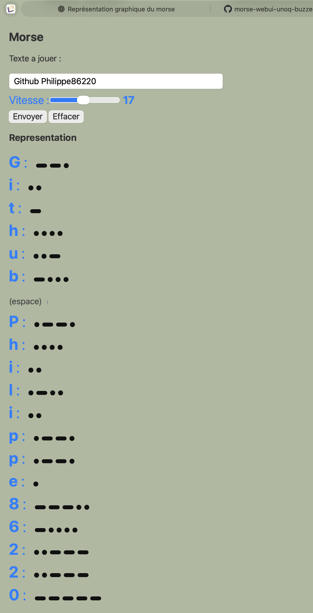

# Morse WebUI – Arduino UNO Q

This project provides a **complete Web interface** to play **Morse code** on an **Arduino UNO Q**,
based on the specific UNO Q architecture (Linux + MCU) and the **Arduino Bridge**.

The audio output is produced by a **Modulino Buzzer**, with **realistic Morse timing** and an **adjustable speed**.
The Web interface also provides a **pedagogical visual representation** of dots and dashes.

This project is both:
- a technical demonstrator for the UNO Q,
- an educational tool around Morse code,
- a clear example of **Web → Python → MCU** integration.

---

## Features

### Web Interface
- Free text input to be sent in Morse code
- Speed adjustment (slider, from 5 to 30)
- Dynamic update of the speed value
- Visual representation of Morse code (dots and dashes)
- Clean, readable interface suitable for educational use
- Can be used simultaneously from multiple browser tabs

### Python Side (UNO Q – Linux)
- Simple HTTP API using WebUI
- Queue-based handling of Morse requests
- Busy / idle state management (prevents collisions)
- Thread-safe synchronization using a lock
- Reliable communication with the MCU via Bridge

### MCU Side (Arduino)
- Reception of text and speed parameters
- Character-by-character Morse decoding
- Compliance with standard Morse timings:
  - dot = 1 unit
  - dash = 3 units
  - inter-element gap = 1 unit
  - inter-letter gap = 3 units
  - inter-word gap ≈ 7–8 units
- Audio generation via Modulino Buzzer

---

## Preview



---

## General Architecture

```
Web Browser
   ↓ HTTP (WebUI)
main.py (Linux – UNO Q)
   ↓ Bridge.call("morse_play")
Arduino UNO Q MCU
   ↓
Modulino Buzzer
```

This clear separation provides:
- an independent Web interface,
- robust synchronization logic on the Python side,
- simple and efficient real-time code on the MCU side.

---

## Repository Organization

```
├- morse-webui-uno-q-buzzer-modulino/
├── README.md
├── LICENSE
├── assets/
│   ├── index.html
│   └── app.js
├── python/
│   └── main.py
├── sketch/
│   ├── sketch.ino
│   ├── Morse.h
│   └── Morse.cpp
└── screenshots/
    └── ui.png
```

### Component Description

#### `assets/`
- **index.html**: HTML structure and CSS styles
- **app.js**: JavaScript logic, API calls, Morse visual rendering

#### `python/main.py`
- Exposure of HTTP endpoints (`/morse`, `/status`, `/speed`, `/ping`)
- Management of a request queue
- Bridge calls to the MCU
- Protection of shared resources using a lock

#### `sketch/`
- **sketch.ino**: Arduino entry point, Bridge and buzzer initialization
- **Morse.h / Morse.cpp**: complete Morse implementation (table, timing, playback)

---

## HTTP API

### Ping
```
GET /ping
```
Checks that the API is reachable.

### Status
```
GET /status
```
Returns:
- busy or idle state
- queue length
- last action
- current speed

### Speed
```
GET /speed
GET /speed?value=17
```
Read or modify the global speed value.

### Morse Playback
```
GET /morse?data=bonjour&speed=17
```
Adds a text to the queue for Morse playback.

---

## Morse Tables

- A Morse table is defined on the **Web side** (JavaScript) for graphical display.
- An equivalent table is defined on the **MCU side** for audio generation.

This duplication is intentional:
- the Web side focuses on pedagogical visualization,
- the MCU side focuses on real-time audio playback.

---

## Technical Notes

- Unsupported characters are ignored on the MCU side
- Text is copied into a static C buffer (memory safety)
- Speed is calculated from a standard WPM base
- Multiple requests can be sent without blocking the interface
- The project was validated by ear by a former Morse instructor

---

## Project Goals

- Explore the capabilities of the Arduino UNO Q architecture
- Implement a full Web → Python → MCU communication chain
- Provide a simple, realistic and educational Morse tool
- Serve as a base for future projects (LEDs, animations, Morse learning tools)

---

## License

This project is released under the **MIT** license.

---

## Author

Personal project around Morse code, Arduino UNO Q, and Web interfaces.

---

## Architecture interne (WebUI → STM32)

A detailed description of the complete path of a request,
From the browser to execution on the STM32:

➡️ [WebUI to STM32 Morse execution flow](WEBUI_TO_STM32_MORSE_FLOW.md)


## Acknowledgements

This project was designed and structured with the help of ChatGPT (OpenAI),
used as a technical assistant for architectural reasoning,
code clarification, and progressive refinement of the project.
